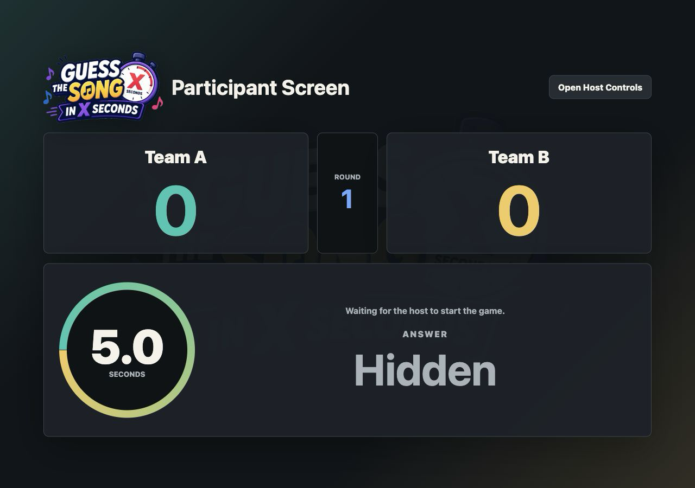
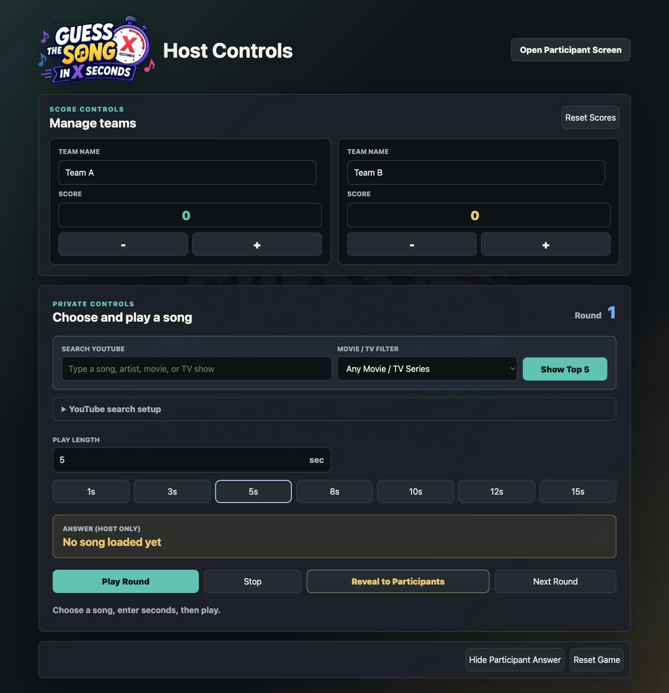

# Guess the Song

A browser-based music quiz for parties, classrooms, team events, and game nights.

[Play the live game](https://anupam5972.github.io/guess-the-song-in-x-seconds/) · [Open Host Controls](https://anupam5972.github.io/guess-the-song-in-x-seconds/?view=host)

The app separates the game into two synchronized browser views:

- **Participant Screen** is display-only and shows team scores, an animated circular countdown, game status, and revealed answers.
- **Host Controls** manages team names and scores, offers quick timer presets, privately searches YouTube, plays timed song clips, advances rounds, and reveals answers.

No build step or backend is required.

## Screens

### Participant Screen



### Host Controls



## Features

- Separate participant and host views
- Display-only participant scoreboard with no score controls
- Animated circular timer that counts down to an empty ring at `0.0`
- Host-only score updates using direct numeric entry or `-` and `+` buttons
- Host-managed custom team names
- Configurable song timer with 1, 3, 5, 8, 10, 12, and 15-second presets
- YouTube search with five playable suggestions
- Movie and TV soundtrack filters
- Private host-only video preview and answer
- One-click answer reveal for participants
- Cross-tab synchronization using `BroadcastChannel` and `localStorage`
- Responsive layout for desktop and mobile browsers
- Zero-build static deployment

## How It Works

Open the app in two browser tabs:

| View | URL | Purpose |
| --- | --- | --- |
| Participant | [Live participant screen](https://anupam5972.github.io/guess-the-song-in-x-seconds/) | Display scores, animated countdown, status, and revealed answers to players |
| Host | [Live host controls](https://anupam5972.github.io/guess-the-song-in-x-seconds/?view=host) | Privately manage scores, teams, song search, and playback |

Both tabs must use the same browser profile and website origin so they can share game state.

## Quick Start

Because the app uses browser storage and external APIs, serve it through a local web server instead of opening `index.html` directly.

```bash
git clone <your-repository-url>
cd guess-the-song
python3 -m http.server 4173
```

Then open:

- Participant screen: [http://localhost:4173](http://localhost:4173)
- Host controls: [http://localhost:4173/?view=host](http://localhost:4173/?view=host)

You can also use any static file server, such as:

```bash
npx serve .
```

## YouTube Setup

YouTube search uses the official YouTube Data API v3.

1. Create or select a project in [Google Cloud Console](https://console.cloud.google.com/).
2. Enable the [YouTube Data API v3](https://console.cloud.google.com/apis/library/youtube.googleapis.com).
3. Create an API key under **APIs & Services > Credentials**.
4. Restrict the key to **YouTube Data API v3**.
5. Add HTTP referrer restrictions for your local and deployed URLs.
6. Open **YouTube search setup** in Host Controls and enter the key.

The key is stored only in that browser's `localStorage`. It is never committed to this repository.

## Playing a Game

1. Open the participant screen and host controls in separate tabs.
2. Display the participant tab on the shared screen.
3. In Host Controls, search for a song or select a Movie/TV filter.
4. Select one of the five YouTube results.
5. Choose a preset or enter a custom clip length, then click **Play Round**.
6. Stop playback or watch the circular timer count down to `0.0`.
7. Award points using direct score entry or the `-` and `+` controls in the host tab.
8. Click **Reveal to Participants** when guesses are complete.
9. Click **Next Round** and continue.

## Project Structure

```text
.
├── app.js
├── assets/
│   └── guess-the-song-logo.png
├── CHANGELOG.md
├── index.html
├── LICENSE
├── style.css
├── docs/
│   └── images/
│       ├── host-controls.png
│       └── participant-screen.png
├── .gitignore
└── README.md
```

## Releases

See [CHANGELOG.md](CHANGELOG.md) for release history and upcoming changes.

## Deployment

This is a static site and can be deployed to:

- GitHub Pages
- Netlify
- Vercel
- Cloudflare Pages
- Any standard web server

For GitHub Pages, publish the repository root and add the deployed domain to the API key's HTTP referrer restrictions.

## Technology

- HTML
- CSS
- Vanilla JavaScript
- YouTube Data API v3
- YouTube IFrame Player API
- Browser `BroadcastChannel` and `localStorage`

## Privacy And Security

- The YouTube API key is stored locally in the host's browser.
- The selected answer and video player stay in the host view.
- Team names and scores can only be changed from Host Controls.
- Only shared game state is synchronized to the participant view.
- API keys used in client-side apps should always have API and referrer restrictions.

## Browser Support

Use a current version of Chrome, Edge, Firefox, or Safari. Cross-tab synchronization requires both views to remain on the same origin.
